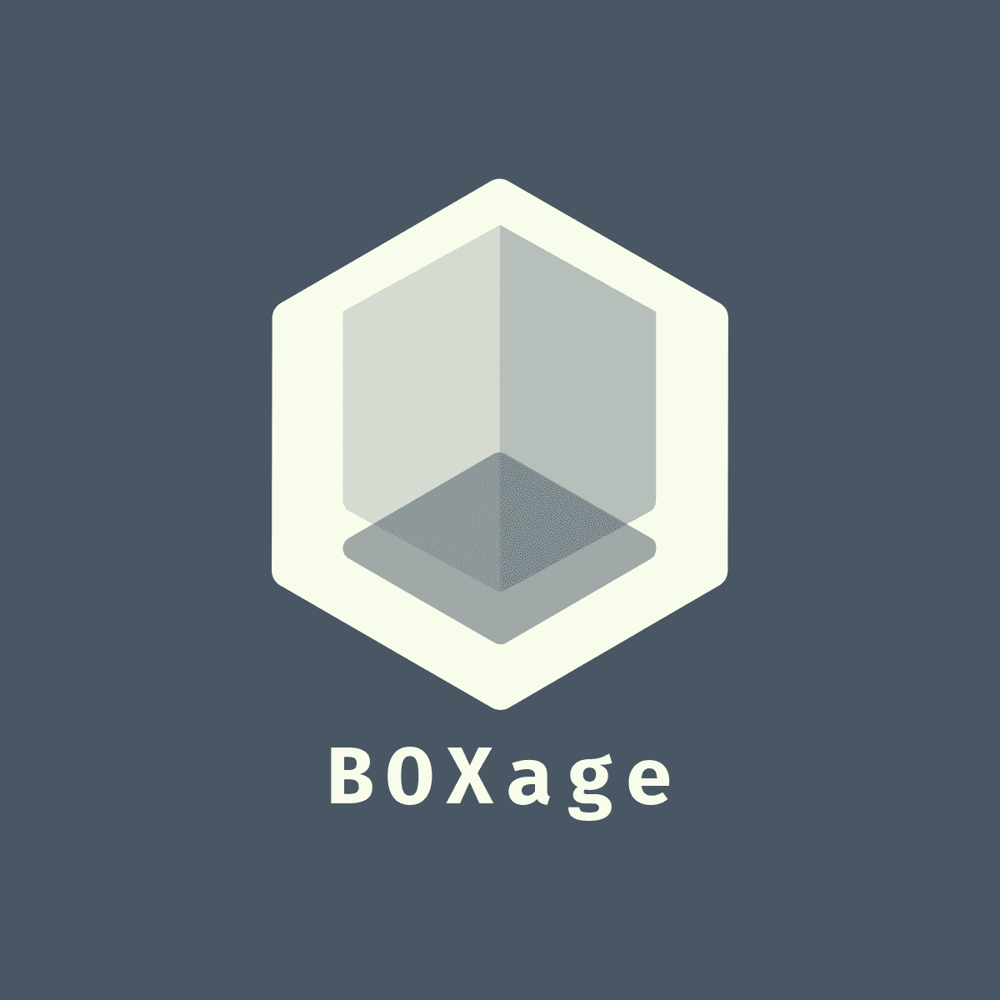

 

  
  <h3 align="center">BOXage</h3>
  

Secure Tracking & Storing System
     
     
        <a href="https://vex-xcc.github.io/BOXage/#/">View Demo</a>
    ·
    <a href="https://github.com/vex-xcc/BOXage/tree/master/client">UI</a>
    ·
    <a href="https://github.com/vex-xcc/BOXage/tree/master/contracts">Smart Contract</a>
   
  

<!-- TABLE OF CONTENTS -->

  
Table of Contents

  <ol>
    <li>
      <a href="#about-the-project">About The Project</a>
      <ul>
        <li><a href="#built-with">Built With</a></li>
      </ul>
    </li>
    <li>
      <a href="#getting-started">Getting Started</a>
      <ul>
        <li><a href="#prerequisites">Prerequisites</a>
        </li>
        <ul>
        <li><a href="#metamask-preparation">MetaMask Preparation</a></li>
        <li><a href="#rinkeby-preparation"> Rinkeby Preparation</a></li>
                <li><a href="#connect-to-boxsage"> Connect To BOXsage
</a></li>
      </ul>
      </ul>
    </li>
    <li><a href="#usage">Usage</a></li>
    <li><a href="#contact">Contact</a></li>
  </ol>

<!-- ABOUT THE PROJECT -->

## About The Project

[![Landing Page Screen Shot][landing-page-screenshot]](https://vex-xcc.github.io/BOXage/#/)

Boxage- Is secure way to store and track the items from the first provider to last beneficiary implemented by smart contract and deployed to the blockchain network.

### Built With

- [React](https://reactjs.org/)
- [Truffle](https://www.trufflesuite.com/)
- [Wb3js](https://web3js.readthedocs.io/en/v1.2.2/)
- [Metamask](https://metamask.io/)
- [GhPages](https://pages.github.com/)
- [Infura](https://infura.io/)
- [ReactIcons](https://react-icons.github.io/react-icons/)
- [StyledComponents](https://styled-components.com/)
- [Sweetalert2](https://sweetalert2.github.io/)

## Getting Started
  ### prerequisites
*  [Wallet Provider Connected To Your Browser](https://Metamask.Io/)
*  [Account Connected With Rinkeby](#metamask-preparation)
*  [Some ETH](https://faucet.rinkeby.io/)

![Metamask Login][metamask-login]

### MetaMask Preparation
  After Download MetaMask Click The Networks List And Chose The 
  Rinkeby Test Network ![MetaMask Networks][metamask-net]
![][metamask-rin]
###  Rinkeby Preparation
 After That Click on Account To Copy Your Account Address And Make a Tweet With Your Ethereum Address By Pasted It Into The Contents Copy The Tweet URL And Paste It Into [Rinkeby Faucet](https://faucet.rinkeby.io/) And Pick The Amount Of ETH.
  ![][Rinkeby-Faucet]
### Connect To BOXsage
Now You Just Need To Open [BOXage](https://vex-xcc.github.io/BOXage/#/) And Connect Your Account To It  
![][MetaMask-conn-1]
![][MetaMask-conn-2]

 
Now You All Set
![][MetaMask-conn]
## Usage

- Supply Chain
- Inventory Management

## Contact

Omar Alhazmi -
omarMMAlhazmi@gmail.com

Live Demo:

[https://vex-xcc.github.io/BOXage/#/](https://vex-xcc.github.io/BOXage/#/)

[landing-page-screenshot]: images/LPage.png

<!-- [customer-registration-screenshot]: images/CS.png -->

[metamask-login]: images/meta.png
[metamask-preparation]: images/meta2.png
[metamask-net]: images/meta-1.png
[metamask-rin]: images/meta-rin.png
[Rinkeby-Faucet]: images/Rinkeby-Faucet.png
[MetaMask-conn-1]: images/conn-1.png
[MetaMask-conn-2]: images/conn-2.png
[MetaMask-conn]: images/connect.png